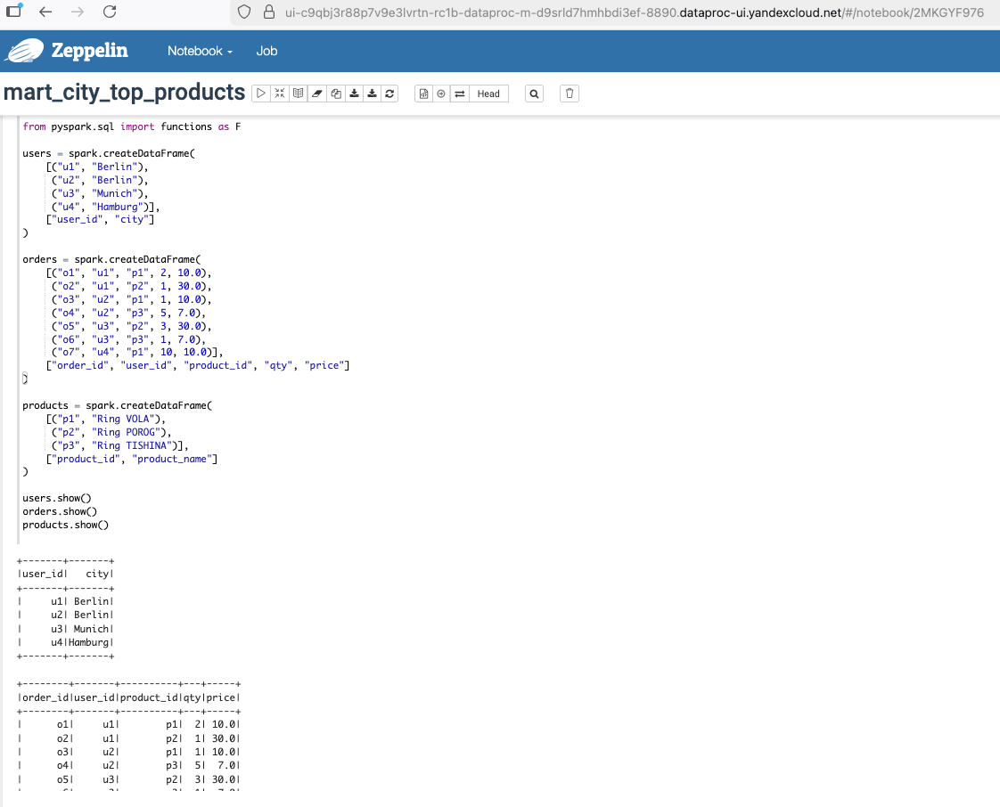
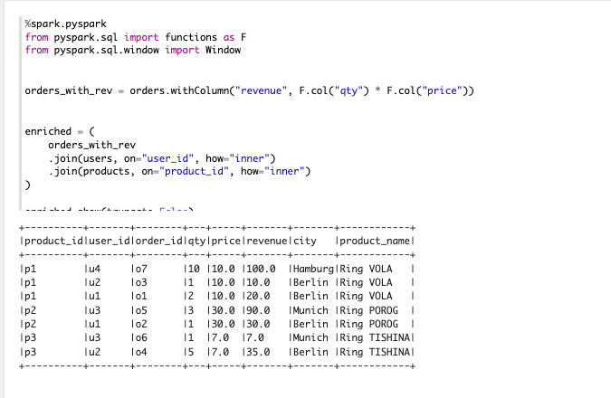
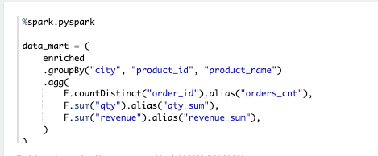
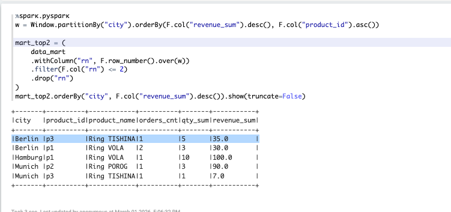
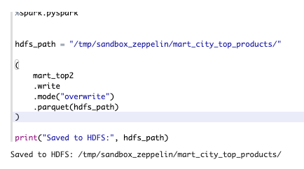
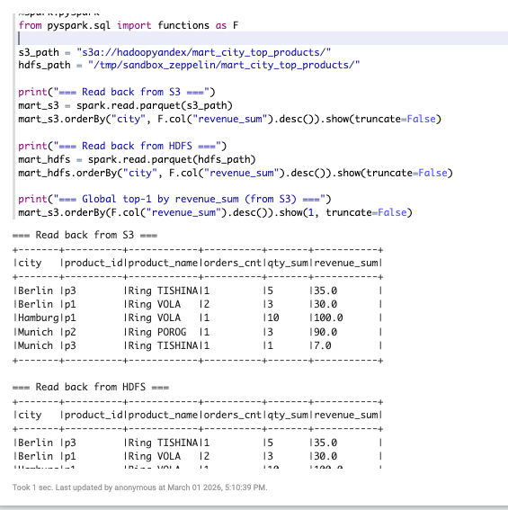
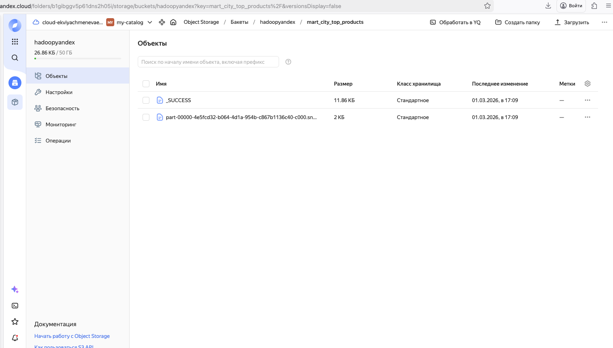

# Mentor_Seminar_YandexCloud_Homework-
# Домашнее задание: Витрина mart_city_top_products

## 🖼️ Скриншоты выполнения

### 1. Создание исходных таблиц

### 2. Расчет revenue и обогащение данных

### 3. Агрегация метрик по городам и товарам

### 4. Применение оконной функции (ранжирование) и топ-2 товара по каждому городу

### 5. Сохранение в HDFS

### 6. Чтение из HDFS и из S3 и проверка

